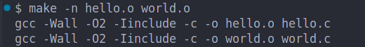
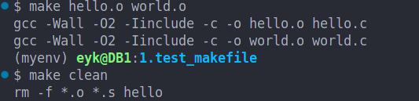
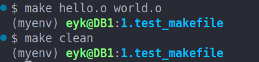

# 一、模式匹配规则：
### 1.作用：

使用模式匹配，使得make命令新增了`基于目标输出文件`的`编译规则`。
例如：
#### 单文件匹配
使得编译命令`make hello.s`有效，因为make会自动查找与hello.s匹配的规则，即.c.s规则。
#### 多文件匹配
使得编译命令`make foo.s bar.s`有效，因为make会自动查找与foo.s和bar.s匹配的规则，即.c.s规则，并逐一运用之。

> 如果我们没有定义.c.s规则，那么make hello.s会报错，因为make找不到与hello.s匹配的规则。


# 二、实战演示：
### 1.源码：
```c
#include <stdio.h>
#include "world.c"
int main()
{
    printf("hello!\n");
    print_world();
    return 0;
}
```

```c
#include <stdio.h>
int print_world()
{
    printf("world!\n");
    return 0;
}
```
### 2.makefile:
```makefile
# Makefile
CC = gcc
CFLAGS = -Wall -O2 -Iinclude
AT= #@


# 模式规则
.c.s:
	$(AT)$(CC) $(CFLAGS) -S -o $*.s $<

# .s.o：将汇编文件编译为目标文件（.o，使用汇编器 $(AS)）。
.s.o:
	$(AT)$(AS)  -o $*.o $<

# .c.o：直接将 C 源文件编译为目标文件（-c 选项，不链接）。
.c.o:
	$(AT)$(CC) $(CFLAGS) -c -o $*.o $<
	
# 这也是第一个目标，也是默认目标，输入make命令时，会执行这个目标
# 最终目标：生成可执行文件
hello: hello.o
	$(AT)$(CC) $(CFLAGS) -o hello hello.o

# 清理目标
clean:
	$(AT)rm -f *.o *.s hello
```

### 3.命令：
#### make
等价于执行第一个目标，即hello: hello.o，那么等价于执行
```c
gcc -Wall -O2 -Iinclude -o hello hello.o
```
但是这里的hello.o是由hello.c生成的，所以hello.o依赖于hello.c，所以make会`自动查找与hello.c匹配的规则`，即.c.o规则，并逐一运用之。
也就是说，这里会额外隐式执行如下命令：
```c
gcc -Wall -O2 -Iinclude -c -o hello.o hello.c
```

验证：
使用命令`make -n`，会显示执行的命令，但是不会执行。
```c
make -n
```
结果


#### make hello.o world.o

等价于分别匹配执行hello.c->hello.o, world.c->world.o的规则，即.c.o规则，并逐一运用之。

即隐式调用如下命令：
```c
gcc -Wall -O2 -Iinclude -c -o hello.o hello.c
gcc -Wall -O2 -Iinclude -c -o world.o world.c
```

验证：
使用命令`make -n`，会显示执行的命令，但是不会执行。

```c
make -n hello.o world.o
```
结果



#### AT=@
这是类似于C语言中的#define的作用，将@替换为空格，即不显示执行的命令。但是如果我们注释掉AT=@，那么就会显示执行的命令。

注释掉，显示具体命令：



未注释掉，不显示命令，只产生结果：

